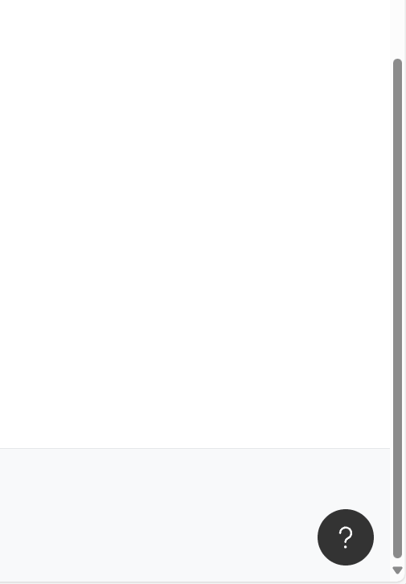
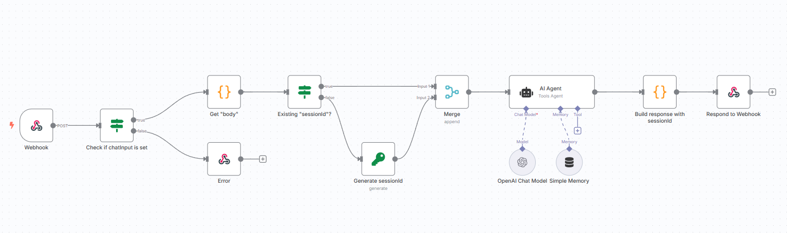

# Interface de Chat Embarcada N8N

<div align="center">


**Componente web nativo para integração de workflows n8n como interface de chat**

</div>

---

## Visão Geral

A Interface de Chat Embarcada N8N é um componente web nativo moderno que permite a integração de workflows n8n como interfaces de chat interativas em qualquer website. A implementação requer apenas algumas linhas de código HTML para transformar automações n8n em interfaces conversacionais.



### Funcionalidades Principais

- **Integração Direta**: Implementação através de uma única tag `<script>` e uma linha de código HTML
- **Suporte Multilingual**: Internacionalização (i18n) com suporte para alemão e inglês
- **Hospedagem Independente**: Bundle pode ser hospedado em domínio próprio sem dependências externas

## Implementação

Configure o website com o seguinte código:

```html
<!-- Adicione essas linhas ao seu website -->
<script src="https://cdn.jsdelivr.net/npm/n8n-embedded-chat-interface@latest/output/index.js"></script>

<n8n-embedded-chat-interface label="Assistente IA" hostname="https://your-n8n-webhook.com/webhook/:id-of-your-webhook-node" open-on-start="false"> </n8n-embedded-chat-interface>
```

## Configuração do Workflow N8N

### 1. Configurar Node Webhook

Crie um novo workflow no n8n com um Node de Trigger **Webhook**:

```json
{
	"httpMethod": "POST",
	"responseMode": "responseNode"
}
```

O corpo da requisição terá o seguinte formato:

```json
{
	"chatInput": "Olá, como você está?",
	"sessionId": "xxx" // segunda mensagem terá um sessionId
}
```

### 2. Implementar Lógica do Chat

Adicione sua lógica de chat (ex: OpenAI, IA local, ou lógica personalizada).



### 3. Formato de Resposta

Seu workflow deve retornar o seguinte formato JSON:

```json
{
	"output": "Resposta do chatbot",
	"sessionId": "session-id"
}
```

A implementação está completa. O website agora possui um chatbot inteligente.

## Build Local e Desenvolvimento

```bash
git clone https://github.com/symbiosika/n8n-embedded-chat-interface
cd n8n-embedded-chat-interface
npm install
npm run build
npm run dev
```

## Configuração

### Configuração Básica

```html
<n8n-embedded-chat-interface label="Nome do Bot" description="Descrição do bot" hostname="https://your-n8n-webhook-url.com" mode="n8n" open-on-start="false"> </n8n-embedded-chat-interface>
```

### Atributos Disponíveis

| Atributo        | Tipo   | Padrão    | Descrição                                |
| --------------- | ------ | --------- | ---------------------------------------- |
| `label`         | String | `""`      | Título da janela do chat                 |
| `description`   | String | `""`      | Descrição do chatbot (não utilizado)    |
| `hostname`      | String | `""`      | **Obrigatório**: URL do webhook n8n     |
| `mode`          | String | `"n8n"`   | Modo do chat (atualmente apenas n8n)    |
| `open-on-start` | String | `"false"` | Abrir chat ao carregar a página          |

### Esquemas de Cores Personalizados

É possível personalizar a aparência da interface de chat especificando cores personalizadas. O componente suporta até 10 propriedades de cor diferentes:

```html
<n8n-embedded-chat-interface
  label="Chat com Tema Personalizado"
  hostname="https://your-n8n-webhook.com"
  primary-color="#2563eb"
  secondary-color="#64748b"
  background-color="#f8fafc"
  text-color="#1e293b"
  accent-color="#3b82f6"
  surface-color="#ffffff"
  border-color="#e2e8f0"
  success-color="#16a34a"
  warning-color="#f59e0b"
  error-color="#dc2626"
  open-on-start="false">
</n8n-embedded-chat-interface>
```

#### Propriedades de Cores

| Propriedade        | Descrição                             | Valores de Exemplo                 |
| ------------------ | ------------------------------------- | ---------------------------------- |
| `primary-color`    | Cor primária (botões, cabeçalho)     | `#2563eb`, `rgb(37,99,235)`, `blue` |
| `secondary-color`  | Cor de acento secundária              | `#64748b`, `gray`, `hsl(215,25%,27%)` |
| `background-color` | Cor de fundo principal                | `#f8fafc`, `white`, `#111827`      |
| `text-color`       | Cor do texto principal                | `#1e293b`, `black`, `#f9fafb`      |
| `accent-color`     | Elementos de destaque e acento        | `#3b82f6`, `rgb(59,130,246)`       |
| `surface-color`    | Fundos de cartões e superfícies       | `#ffffff`, `#1f2937`               |
| `border-color`     | Cor de bordas e divisores             | `#e2e8f0`, `#374151`               |
| `success-color`    | Mensagens e indicadores de sucesso    | `#16a34a`, `green`                 |
| `warning-color`    | Mensagens e indicadores de aviso      | `#f59e0b`, `orange`                |
| `error-color`      | Mensagens e indicadores de erro       | `#dc2626`, `red`                   |

#### Formatos de Cor Suportados

- **Cores hexadecimais**: `#ff0000`, `#f00`, `#ff0000ff`
- **RGB/RGBA**: `rgb(255,0,0)`, `rgba(255,0,0,0.5)`
- **HSL/HSLA**: `hsl(0,100%,50%)`, `hsla(0,100%,50%,0.5)`
- **Cores nomeadas**: `red`, `blue`, `transparent`, etc.

#### Segurança e Validação

Todos os valores de cor são automaticamente validados para prevenir ataques de injeção CSS. Valores de cor inválidos serão ignorados e registrados como avisos no console do navegador.

#### Exemplos de Temas

**Tema Azul Corporativo:**
```html
<n8n-embedded-chat-interface
  primary-color="#2563eb"
  secondary-color="#64748b"
  background-color="#f8fafc"
  text-color="#1e293b"
  hostname="your-webhook-url">
</n8n-embedded-chat-interface>
```

**Tema Escuro:**
```html
<n8n-embedded-chat-interface
  primary-color="#3b82f6"
  background-color="#111827"
  text-color="#f9fafb"
  surface-color="#1f2937"
  hostname="your-webhook-url">
</n8n-embedded-chat-interface>
```